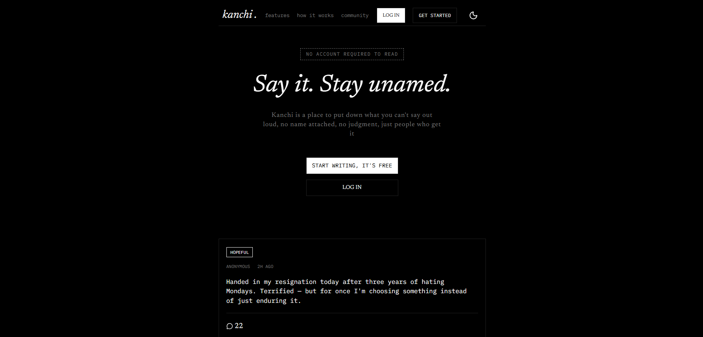
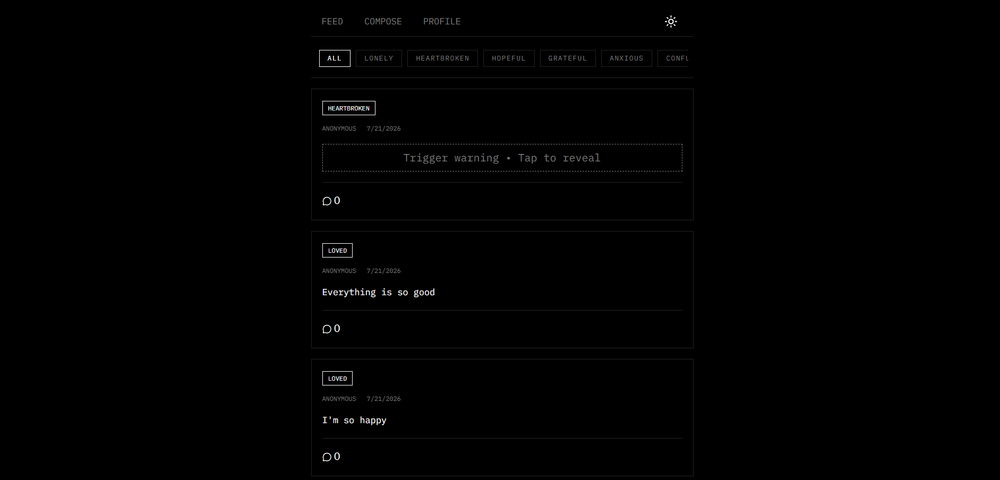
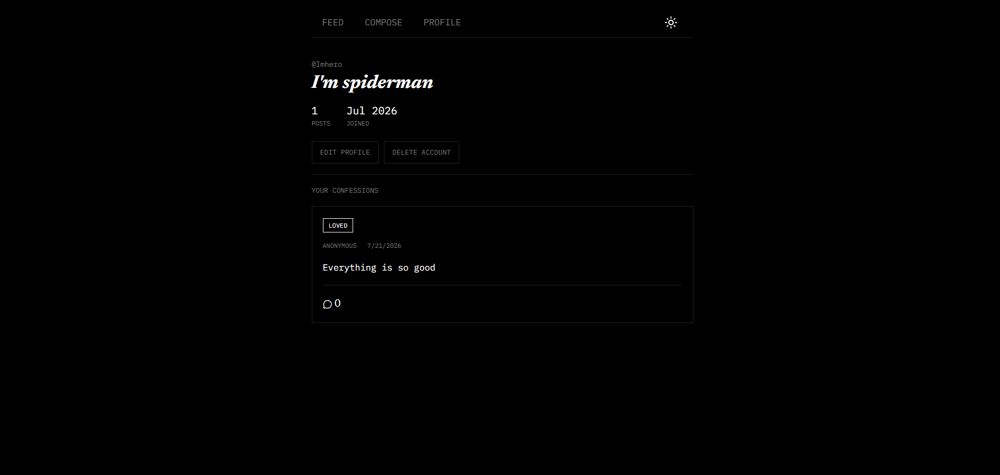

<div align="center">

# kanchi

<p><strong>A serious social platform where users can anonymously share emotions, confessions, thoughts, and experiences in real time.</strong></p>

<p>
  
  
  
  
  
</p>

</div>

---

# About

**kanchi** is an anonymous emotional journaling platform where people can share feelings without chasing likes, followers, or popularity.

Unlike traditional social media, **kanchi** removes identity from conversations. Every confession is anonymous. The focus is empathy instead of engagement.

Whether someone feels lonely, anxious, grateful, guilty, hopeful, or simply wants to write what they can't tell anyone else, kanchi provides a calm place to do it.

---

# Screenshots


<div align="center">



<br>



<br>



</div>

---

# Features

- Anonymous emotional posts
- Emotion-based feed filtering
- Trigger warning support
- Authentication using JWT
- User profiles
- Edit profile
- Delete account
- Create comments
- Responsive UI
- Clean typography
- Minimal distraction-free interface

---


# Tech Stack

### Frontend

- Next.js 16 (App Router)
- React 19
- TypeScript
- Tailwind CSS v4

### Backend

- Next.js Route Handlers
- JWT Authentication
- bcryptjs

### Database

- Prisma ORM
- Neon PostgreSQL

### Validation

- Zod

---

# Getting Started

## Prerequisites

- Node.js 20+
- PostgreSQL
- npm or pnpm

---

## Installation

Clone the repository

```bash
git clone https://github.com/furishere/kanchi.git
```

Move into the project

```bash
cd kanchi
```

Install dependencies

```bash
npm install
```

or

```bash
pnpm install
```

---

# Environment Variables

Create a `.env` file.

```env
DATABASE_URL=

JWT_SECRET=
```

---

# Database

Generate Prisma Client

```bash
npx prisma generate
```

Run migrations

```bash
npx prisma migrate dev
```

---

# Running Development Server

```bash
npm run dev
```

Visit

```
http://localhost:3000
```

---

# Available Scripts

```bash
npm run dev
```

Runs development server.

```bash
npm run build
```

Creates production build.

```bash
npm run start
```

Starts production server.

```bash
npm run lint
```

Runs ESLint.

---

# Contributing

Contributions are welcome.

Feel free to open an issue or submit a pull request.

---

# License

This project is licensed under the **MIT License**.

See the **LICENSE** file for details.

---

<div align="center">

Made with ❤️ by **Hariom Mandal**

GitHub → https://github.com/furishere

</div>